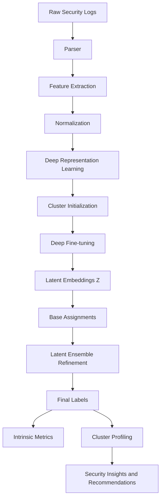
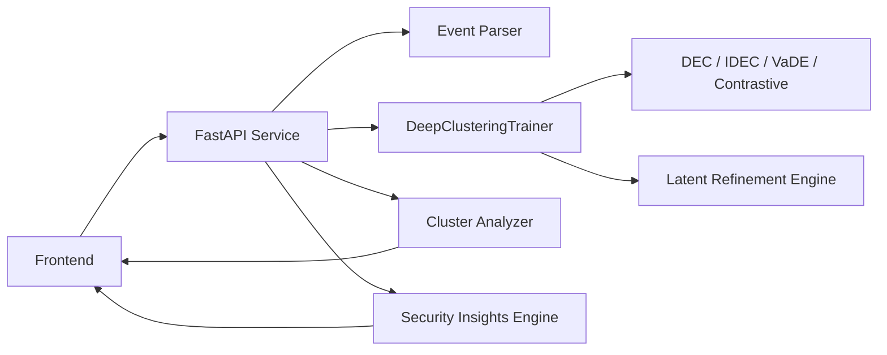
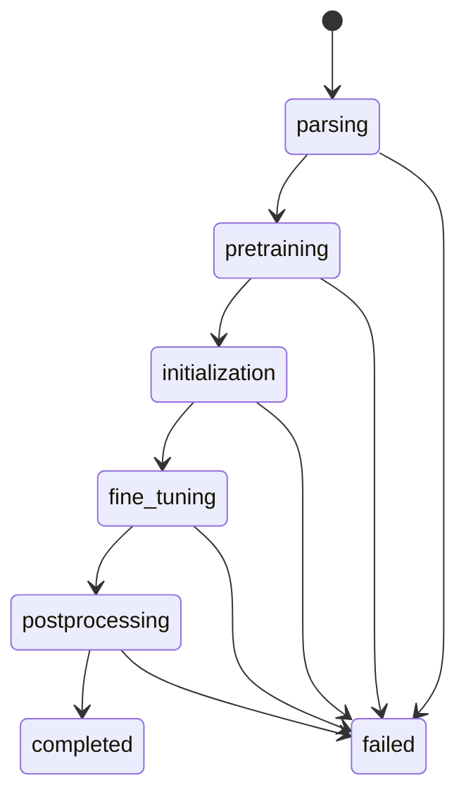
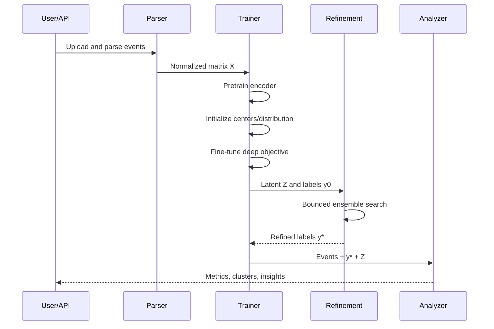
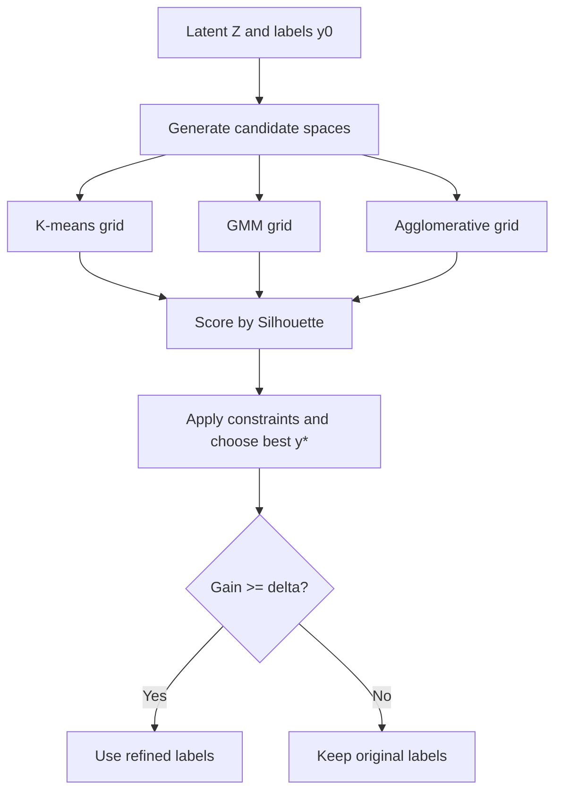

# Deep Representation Learning for Security Event Clustering

## Abstract

This document provides a research-grade technical specification for the deep clustering stack implemented in this project. The system addresses unsupervised organization of high-volume security telemetry by coupling (1) learned latent representations, (2) cluster-aware optimization objectives, and (3) post-hoc intrinsic quality maximization under runtime constraints. Supported model families include Deep Embedded Clustering (DEC), Improved DEC (IDEC), Variational Deep Embedding (VaDE), and contrastive deep clustering. The production pipeline extends classical deep clustering with an explicit latent ensemble refinement stage that performs algorithm and cluster-count search to improve partition quality, while preserving operational latency.

---

## 1. Introduction and Motivation

Modern security operations centers ingest heterogeneous, weakly labeled, and often noisy event streams from firewalls, IDS/IPS, WAF, endpoint telemetry, and authentication systems. Manual triage over millions of events is intractable. Traditional shallow clustering (single K-means over handcrafted vectors) frequently underperforms because:

- event semantics are nonlinear and sparse,
- useful dimensions are entangled with nuisance variance,
- cluster geometry is non-spherical and scale-dependent,
- useful operational clusters may not align with fixed Euclidean assumptions.

Deep clustering addresses these issues by learning latent structures jointly with clustering objectives. However, deep models can still converge to suboptimal partitions due to initialization and local minima. Therefore, this system uses a two-layer strategy:

1. learn robust latent embeddings through deep objectives, and
2. optimize assignments in latent space using intrinsic metric-driven search.

### 1.1 Related Works

Research on unsupervised security analytics spans three major lines: classical clustering, deep clustering, and domain-specific security log mining.

#### Classical Clustering and Representation Limits

Earlier operational pipelines frequently rely on K-means, hierarchical clustering, DBSCAN, or Gaussian mixtures over hand-engineered event vectors. These approaches are computationally attractive and interpretable, but they assume geometry that may not hold for mixed security telemetry:

- K-means favors spherical, equal-variance clusters under Euclidean distance.
- GMM can model softer boundaries but may still be sensitive to feature scaling and initialization.
- Hierarchical methods capture nested structure but can become expensive at scale.
- Density-based methods handle arbitrary shapes but often struggle with variable density and high-dimensional sparse features.

In SOC data, where event semantics are heterogeneous and sparse, feature engineering quality strongly determines outcome quality, creating a ceiling for shallow clustering performance.

#### Deep Clustering Literature

Deep clustering emerged to jointly learn representation and partition structure. A common paradigm is:

1. train an autoencoder (or representation backbone),
2. initialize clusters in latent space,
3. optimize a clustering-aligned objective.

Representative families include:

- **DEC-style methods**: use KL-based target distribution refinement to sharpen assignments.
- **IDEC-style methods**: preserve reconstruction during clustering updates to reduce latent drift.
- **VaDE-style methods**: combine latent generative modeling with mixture priors for probabilistic assignments.
- **Contrastive/self-supervised clustering**: enforce invariance across augmentations and improve robustness under noisy inputs.

The major lesson from these works is that representation quality and assignment quality must be optimized together, but no single objective is universally dominant across datasets.

#### Security Event Clustering and Threat Intelligence

Security-focused studies often cluster alerts/logs for:

- alert reduction and deduplication,
- campaign discovery,
- anomaly triage,
- IOC grouping and correlation analysis.

Many practical systems still use static features with shallow clustering, then apply rule-based enrichment. This can help operationally but may fail when novel attack patterns alter feature distributions. More recent works suggest combining latent learning with post-clustering semantics extraction (e.g., subsystem/action trends, source-target behavior, severity context), which aligns with SOC analyst workflows.

#### Positioning of This Work

Relative to prior lines, this implementation combines:

- deep latent learning (multiple model families),
- intrinsic metric-aware selection and monitoring,
- bounded ensemble refinement after fine-tuning,
- direct integration with security insight generation.

In other words, it bridges research-grade clustering quality optimization with production-grade API and analyst-facing outputs.

---

## 2. Problem Statement

Let the parsed event dataset be:

$\mathcal{D} = \{x_i\}_{i=1}^{N}, \quad x_i \in \mathbb{R}^{d}$

where each $x_i$ is a normalized feature vector derived from raw log fields.

The goal is to estimate:

1. a parametric encoder $f_\theta: \mathbb{R}^{d} \rightarrow \mathbb{R}^{m}$, with $m \ll d$,
2. cluster assignments $y_i \in 1,\dots,K$, where $K$ may be fixed or searched.

$z_i = f_\theta(x_i), \quad y_i = g(z_i)$

Given no reliable labels for most production streams, optimization is unsupervised and quality is assessed through intrinsic criteria (Silhouette, DBI, CH), cluster stability, and downstream security utility.

### 2.1 Why This Problem Must Be Researched in Security

In enterprise and cloud security operations, analysts face an asymmetry problem: telemetry volume grows faster than human triage capacity. Attackers exploit this asymmetry through high-noise tactics (alert flooding, low-and-slow behavior, distributed probing), making manual pattern discovery both expensive and error-prone.

This creates a strong research need for unsupervised clustering that can:

- group semantically related events without labeled attack truth,
- reveal campaign-like behavior spanning multiple tools/subsystems,
- prioritize analyst attention toward high-risk patterns,
- reduce cognitive load and mean-time-to-understand (MTTU).

Unlike many generic clustering tasks, security clustering has mission-critical consequences. Poor grouping can hide attack progression, while useful grouping can compress thousands of low-level logs into actionable incident hypotheses.

### 2.2 Security-Specific Challenges

The security domain imposes constraints that make this problem nontrivial:

- **Label sparsity**: reliable ground truth is limited, delayed, or incomplete.
- **Non-stationarity**: attacker behavior and defensive controls evolve over time.
- **Heterogeneous telemetry**: logs from different products have different schemas and semantics.
- **Extreme imbalance**: truly malicious events are often rare relative to benign background traffic.
- **Adversarial pressure**: attackers deliberately generate evasive and noisy patterns.

Therefore, clustering must be robust not only statistically, but operationally, under drift and ambiguity.

### 2.3 Why the Target Objective Matters

The research objective is not merely to optimize an abstract metric; it is to improve security outcomes. Achieving compact, well-separated latent clusters supports:

- **Early threat discovery**: suspicious micro-patterns become visible before rule signatures exist.
- **Attack-chain visibility**: related events can be linked across time and subsystems.
- **Triage acceleration**: analysts investigate a smaller set of cluster-level entities instead of raw event streams.
- **Prioritization quality**: critical/high-risk clusters are easier to isolate and escalate.
- **Knowledge transfer**: cluster profiles can be reused for threat hunting and detection engineering.

In practical SOC terms, this maps to faster detection-to-response loops and lower risk of missed incidents.

### 2.4 Formal Security Utility Perspective

Let $\mathcal{I}(y)$ denote incident utility of assignments $y$, reflecting analyst-facing value (prioritization accuracy, cluster interpretability, threat enrichment quality). The system seeks high intrinsic structure while preserving operational utility:

$\max_{f_\theta,g} \ \mathcal{Q}_{intrinsic}(y, Z) + \lambda \mathcal{I}(y)$

where $\mathcal{Q}_{intrinsic}$ aggregates intrinsic quality signals (e.g., Silhouette, DBI, CH) and $\lambda$ controls emphasis on SOC utility. This framing clarifies why research should jointly optimize geometric quality and security relevance.

### 2.5 Success Criteria Under Security Constraints

A meaningful solution in this domain should satisfy:

1. intrinsic quality improvement over shallow baselines,
2. stable clusters under moderate data perturbations,
3. actionable semantic profiles for analyst workflows,
4. bounded runtime compatible with production response windows.

Hence, this problem is worth pursuing because it addresses both scientific challenges (unsupervised representation and partitioning under drift/noise) and operational security needs (faster, more reliable incident understanding).

---

## 3. Research Contributions of This System

This implementation contributes the following engineering-research elements:

- Multi-family deep clustering support in one pipeline (DEC/IDEC/VaDE/contrastive).
- Stage-aware training orchestration and real-time progress reporting.
- Intrinsic metric computation integrated into both training and result APIs.
- Post-fine-tuning latent ensemble refinement:
  - multi-algorithm search (K-means, GMM, agglomerative),
  - multi-$K$ search over bounded ranges,
  - multi-projection search (latent + PCA variants),
  - minimum cluster-size constraints,
  - hard wall-clock budget to avoid operational stalls.
- Security analytics integration from cluster outputs to threat-centric summaries.

---

## 4. End-to-End System Architecture

### 4.1 High-Level Data Flow

This high-level data-flow architecture is selected because security clustering is not a single algorithmic step; it is a pipeline that must transform noisy raw logs into reliable analyst outputs. A linear staged flow is preferable here because each stage has a distinct failure mode, quality contribution, and observability requirement.

Advantages of this architecture include:

- **Modularity**: parsing, feature engineering, learning, refinement, and insight generation can be improved independently.
- **Traceability**: analysts and engineers can inspect where quality degradation occurs (input quality vs model quality vs postprocessing quality).
- **Reproducibility**: explicit stage boundaries support controlled experiments and ablation studies.
- **Operational robustness**: failures can be localized to stages without collapsing the entire workflow design.

This data-flow figure describes how raw security telemetry is transformed into analyst-ready cluster intelligence. Each labeled block corresponds to a distinct transformation step:

- `**A: Raw Security Logs**`: source event strings collected from security tooling (firewalls, IDS/IPS, WAF, authentication, etc.).
- `**B: Parser**`: parses raw strings into structured event fields (timestamp, src/dst, subsystem, action, severity, and content-derived signals when available).
- `**C: Feature Extraction**`: converts parsed event fields into a fixed-length numeric vector per event, capturing semantics relevant to clustering.
- `**D: Normalization**`: standardizes each feature dimension using dataset mean and variance so that distance computations in later steps are stable and comparable.
- `**E: Deep Representation Learning**`: the encoder part of the selected deep clustering model maps normalized features into a latent embedding space where cluster geometry is more separable.
- `**F: Cluster Initialization**`: produces initial cluster seeds/assignments (e.g., via GMM/K-means in latent space or model-specific initialization) to prevent degenerate clustering updates.
- `**G: Deep Fine-tuning**`: optimizes the clustering-aware objective (DEC/IDEC/VaDE/contrastive) to refine both latent geometry and soft assignment structure.
- `**H: Latent Embeddings Z**`: stores the learned embedding vectors $z_i=f_\theta(x_i)$ for all events, which are the basis for final clustering and metrics.
- `**I: Base Assignments**`: converts model outputs into discrete cluster labels (typically by taking argmax over soft assignment probabilities).
- `**J: Latent Ensemble Refinement**`: performs a bounded search over alternative latent partitions (algorithm choice, cluster-count candidates, and projection variants) to improve intrinsic quality.
- `**K: Final Labels**`: selects the refined labels and treats them as the canonical clustering result for downstream profiling.
- `**L: Intrinsic Metrics**`: computes Silhouette, Davies–Bouldin, and Calinski–Harabasz from the same latent representation used for clustering, enabling consistent quality reporting.
- `**M: Cluster Profiling**`: aggregates per-event information under each label to produce cluster summaries such as dominant subsystems/actions and representative events.
- `**N: Security Insights and Recommendations**`: converts cluster profiles into analyst-facing intelligence (threat indicators, priority/risk assessment, and recommended actions).

### 4.2 Runtime Component View

This runtime component architecture is selected to separate user interaction, API orchestration, model training, and intelligence generation. In SOC-facing systems, this separation is essential to keep interfaces responsive while expensive training and refinement run in background processes.

Advantages of this architecture include:

- **Scalability**: heavy ML components are isolated from request-handling logic.
- **Responsiveness**: asynchronous job handling prevents UI/API blocking during long training tasks.
- **Maintainability**: each runtime component has a clear responsibility and interface contract.
- **Extensibility**: new model families or insight modules can be added with limited impact on other components.

This runtime component view explains where each transformation is executed and how data moves between runtime services:

- `**U: Frontend**`: controls the user workflow (start training, poll progress, fetch results) and renders cluster metrics and insights.
- `**API: FastAPI Service**`: exposes HTTP endpoints (train, status, results, cluster events, insights) and coordinates background training so the UI thread stays responsive.
- `**PARSER: Event Parser**`: reused by the API to parse raw strings into structured events and then to produce normalized feature matrices for training.
- `**TRAINER: DeepClusteringTrainer**`: encapsulates model training logic, including pretraining, initialization, fine-tuning, and inference of latent embeddings and soft assignments.
- `**MODELS: DEC / IDEC / VaDE / Contrastive**`: selects the deep clustering objective family; it defines how embeddings are shaped and how assignments are represented.
- `**REFINE: Latent Refinement Engine**`: post-processes model output using intrinsic metrics by exploring candidate partitions under time and validity constraints.
- `**ANALYZER: Cluster Analyzer**`: consumes refined labels and events to compute cluster-level profiles (representative events, top entities, severity distributions, etc.).
- `**INSIGHTS: Security Insights Engine**`: maps cluster profiles into higher-level intelligence (risk assessment, attack pattern hints, and correlations).

### 4.3 Stage Transitions

This stage-transition architecture is selected to explicitly model long-running, multi-phase training behavior as a finite set of states. In production security tooling, users must distinguish between active computation, postprocessing, and error states to avoid false assumptions about hangs or silent failures.

Advantages of this architecture include:

- **Transparent progress semantics**: users can see exactly which computational phase is executing.
- **Better failure handling**: stage-specific error reporting improves diagnosis and recovery.
- **Control and governance**: transitions enforce a deterministic training lifecycle.
- **User trust**: explicit postprocessing state explains delays after fine-tuning and reduces confusion.

Stage transitions make the end-to-end compute schedule explicit. This is especially important for security analytics UX, because the UI needs to distinguish model convergence from expensive bounded post-processing. Each stage corresponds to a specific technical operation:

- `**parsing**`: converts raw event strings into structured events and a normalized feature matrix; errors here typically reflect schema problems or unsupported input formats.
- `**pretraining**`: learns an embedding manifold that supports clustering by reconstruction (DEC/IDEC/VaDE) or contrastive invariance (contrastive).
- `**initialization**`: establishes initial cluster assignments/seeds in latent space; deep clustering objectives are sensitive to this step, and poor seeds can lead to collapse-like solutions.
- `**fine_tuning**`: optimizes the selected deep clustering objective while periodically updating assignments/targets and monitoring intrinsic metrics and assignment drift.
- `**postprocessing**`: refines the final discrete partition via latent ensemble search (varying algorithm type, candidate cluster counts, and latent projections) under a strict runtime budget and validity constraints (e.g., minimum cluster size).
- `**completed**`: the API can safely return final results (labels, intrinsic metrics, latent visualization, and cluster profiles).
- `**failed**`: any unrecoverable error in the corresponding stage triggers this terminal state, allowing the UI to surface a diagnostic message rather than waiting indefinitely.

If you observe logs such as `Fine-tuning complete!` without a rapid `completed`, it typically indicates the system is still in `postprocessing` (bounded refinement), not that training is stuck.

---

## 5. Data Representation and Preprocessing

### 5.1 Design Goals for Representation

The representation layer is designed for a security-first objective: preserve attack-relevant structure while reducing noise and schema variance across telemetry sources. In practice, this means balancing:

- **Discriminability**: features should separate behavior regimes (benign baseline, policy violations, reconnaissance, exploitation, and post-compromise traces) so latent clusters encode security-relevant distinctions.
- **Robustness**: representation must remain stable when logs are noisy, partially missing, or inconsistently formatted across devices and vendors.
- **Scalability**: feature construction must support high-throughput SOC ingestion without introducing prohibitive preprocessing latency.
- **Operational interpretability**: transformed vectors should still map back to understandable event semantics so analysts can validate and act on cluster outputs.

### 5.2 Structured Event Vectorization

Raw events are parsed into typed fields and converted into fixed-length numeric vectors. Typical feature groups include:

- **Network context**: captures communication topology (source/destination patterns, service ports, protocol hints), which is critical for detecting scanning, lateral movement, and exfiltration-like behavior.
- **Security semantics**: encodes subsystem and action intent (e.g., block/allow/deny/quarantine), preserving the defensive meaning of each event rather than only its raw transport attributes.
- **Behavioral signals**: includes frequency and recurrence cues that help identify brute-force bursts, beaconing-like repetition, or unusual rate shifts.
- **Meta fields**: introduces structural and time-derived indicators that support coarse temporal reasoning and event-type differentiation.

Formally, each event is mapped by a parser/featurizer:

$\phi:\ \text{raw event} \rightarrow x_i \in \mathbb{R}^{d}$

so the dataset matrix is:

$X = [x_1^\top, x_2^\top, \dots, x_N^\top] \in \mathbb{R}^{N \times d}$

### 5.3 Feature Typing and Encoding Strategy

To make heterogeneous logs compatible with deep models, fields are encoded by type:

- **Continuous numeric fields**: used as magnitude-bearing features after scale control; heavy-tailed values can be transformed to reduce domination by extreme observations.
- **Ordinal fields**: mapped to ordered numeric levels only when domain ordering is semantically valid (for example, graded severity scales).
- **Categorical fields**: encoded to preserve discrete security semantics; encoding choice is constrained by cardinality, memory budget, and model input compatibility.
- **Text-like content markers**: converted into compact indicator signals (keyword/category flags) to retain high-value threat cues without introducing heavyweight NLP dependencies.

This typed encoding is critical in security data because categorical semantics (subsystem/action) often carry stronger attack signal than raw magnitudes.

### 5.4 Missing Values and Schema Drift

Security telemetry frequently has incomplete or source-specific fields. Representation must remain stable when attributes are absent. The preprocessing layer therefore treats missingness as first-class:

- **Missing-to-neutral mapping**: absent values are mapped to safe defaults so vectors remain numerically valid and model inputs remain shape-consistent.
- **Schema-compatible dimensionality**: subsystem-specific missing fields do not alter feature dimensionality, preventing training/inference mismatch across mixed log sources.
- **Early parser isolation**: malformed records are handled during `parsing`, which prevents silent contamination of downstream clustering statistics.

This design improves resilience under vendor schema changes and mixed data-source ingestion.

### 5.5 Normalization and Scale Control

Per-feature standardization:

$\tilde{x}*{ij} = \frac{x*{ij} - \mu_j}{\sigma_j + \epsilon}$

where $\mu_j$ and $\sigma_j$ are empirical training statistics and $\epsilon$ avoids division instability.

Normalized data matrix:

$\tilde{X} = [\tilde{x}_1^\top,\dots,\tilde{x}_N^\top]$

### 5.6 Why Normalization Is Necessary

Normalization is not optional in this setting; it directly affects training dynamics and clustering geometry:

- **Gradient stability**: keeps optimization numerically stable during pretraining and fine-tuning by preventing disproportionately large parameter updates.
- **Distance fairness**: prevents large-scale fields from overwhelming distance-based objectives used in assignment and refinement steps.
- **Latent comparability**: improves consistency of geometry for downstream K-means, GMM, and agglomerative partitioning in latent space.
- **Cross-tool harmonization**: reduces unit and scale mismatch across heterogeneous security products, improving joint modeling reliability.

### 5.7 Outliers, Bursts, and Rare Events

In security operations, outliers are ambiguous: some are noise, some are genuine attacks. Preprocessing therefore avoids aggressive outlier removal. Instead, the pipeline prefers:

- **Robust scaling/normalization**: limits undue influence from transient spikes while preserving potentially meaningful deviations.
- **Latent compression**: encourages the model to retain shared structure and suppress nuisance variance that does not contribute to cluster discrimination.
- **Contextualized rare-event handling**: keeps rare points for clustering/profile analysis instead of removing them, since low-frequency events may represent early-stage attacks.

This is important because deleting rare points can remove early indicators of targeted attacks.

### 5.8 Temporal and Session Context

Although the current representation is primarily event-centric, timestamp information can still contribute through engineered temporal features (time windows, burst markers, periodicity hints). This supports partial reconstruction of campaign dynamics even without full sequence modeling.

Future extensions can move from event-wise vectors to sequence/session representations for richer temporal threat behavior.

### 5.9 Noise and Sparsity Characteristics

Security logs commonly exhibit:

- **Missing fields**: incomplete records from partial logging configurations or parser limitations.
- **Repeated boilerplate entries**: highly redundant logs that inflate dataset size without proportional information gain.
- **Bursty anomalies**: short-lived spikes (e.g., scan or brute-force bursts) that can distort naive distribution assumptions.
- **Mixed periodic and attack-driven regimes**: coexistence of routine cyclical traffic and adversarial behavior, producing multimodal and time-varying distributions.

Deep latent learning mitigates these effects by compressing correlated structure, smoothing local noise, and emphasizing dimensions that support clustering objectives.

### 5.10 Preprocessing Quality Controls

For reliable downstream clustering, preprocessing should be audited with:

- **Feature distribution audits**: compare pre/post-normalization distributions to detect saturation, collapse, or unintended scaling artifacts.
- **Missingness monitoring**: track per-field and per-source missing rates to identify telemetry degradation and schema drift early.
- **Parser reliability metrics**: maintain error/rejection counters to quantify ingestion quality and prevent hidden data-quality regressions.
- **Temporal drift checks**: evaluate batch/window shifts to detect non-stationarity that may require retraining or feature reconfiguration.

These controls are essential because representation quality strongly bounds achievable cluster quality, regardless of model sophistication.

### 5.11 Feature Encoder Improvements for Clustering Accuracy

The deep encoder $f_\theta$ can only exploit structure that is present (or recoverable) in the input vectors $x_i$. Improvements to the hand-crafted encoder $\phi$ therefore raise the **ceiling** for both training stability and intrinsic metrics (e.g., Silhouette), especially when logs carry free-text `content` and high-cardinality categorical fields. The following enhancements are implemented in the event featurizer and are orthogonal to the choice of model family: they sharpen the input geometry before latent learning and refinement.

**Deterministic categorical projection.** High-cardinality or opaque string identifiers (e.g., IPS `rule_id`, firewall zone pairs) are mapped to a fixed interval using a **stable** hash: UTF-8 MD5 digest, reduction modulo $M$, then normalization to $[0,1]$:

$h_M(s) = \frac{(\text{int}(\text{MD5}(s)) \bmod M)}{M - 1}$

(with the empty string mapped to $0$). This replaces process-dependent `hash()` semantics so repeated training runs, A/B comparisons, and regression tests see **reproducible** feature values for the same log corpus. Reproducibility matters for SOC tooling: analysts and engineers must be able to trust that a configuration change in the model—not random featurization—drives metric deltas.

**Cyclic hour encoding.** Raw normalized hour treats midnight as a discontinuity. The encoder uses a two-dimensional cyclic representation:

$\big(\sin(2\pi t/24),\ \cos(2\pi t/24)\big)$

for hour $t$, together with day-of-week and business-hours indicators. Neighboring hours stay close in Euclidean space, which better matches true temporal proximity for diurnal attack and operational patterns.

**Semantic content channel.** Beyond normalized content length, the parser adds a compact **threat-semantic** block derived from `content` (lowercased): six fixed keyword groups (credential/auth abuse, malware/execution, reconnaissance/scanning, exfiltration/data movement, web-application attack language, and C2/persistence/lateral-movement hints). Each group contributes a binary “any phrase matched” feature. Two structural scalars augment separability: **token count** (capped and scaled) and **exclamation density** (capped), which help distinguish verbose alerts, marketing noise, or vendor-specific formatting from terse firewall lines. This channel is intentionally lightweight—no transformer or large vocabulary—so ingestion stays fast while still pulling attack-relevant language into $x_i$.

**Vector dimension.** After these additions, fixed-length event vectors use $d = 70$ dimensions (including the existing padded subsystem-specific block), exposed consistently via the parser’s reported feature dimension for model construction.

**Interaction with the rest of the pipeline.** Vectors are still passed through per-dataset standardization (Section 5.5) before $f_\theta$. Thus, encoder improvements act as a **better-conditioned** input to pretraining, cluster initialization, and latent ensemble refinement: separable directions in $x$ are easier to preserve in $z$, which supports clearer partitions and stronger intrinsic scores when the underlying behaviors differ along those axes.

---

## 6. Model Families

In this document, a **model family** means a class of deep clustering methods that share the same core training idea and objective function. We consider model families because no single clustering objective works best for every security dataset. Different SOC environments have different properties (noise level, class imbalance, behavior overlap, and compute constraints), so model selection is a practical and scientific decision rather than a fixed default.

It is helpful to think of model families as different "ways to teach the latent space what a good cluster looks like":

- some methods strongly force cluster separation,
- some methods preserve reconstruction fidelity while clustering,
- some methods add probabilistic uncertainty modeling,
- some methods learn invariances through augmentation consistency.

Choosing among these families is important because the choice directly affects:

- **Cluster compactness/separation**: this describes how tight each cluster is internally and how far clusters are from each other; in practice it is evaluated using intrinsic metrics such as Silhouette (higher is better), Davies-Bouldin Index (lower is better), and Calinski-Harabasz (higher is better). Better compactness/separation usually leads to cleaner threat groupings and less mixing between benign and suspicious behaviors.

$ S=\frac{1}{N}\sum_{i=1}^{N}\frac{b(i)-a(i)}{\max\{a(i),b(i)\}},\quad$
$\mathrm{DBI}=\frac{1}{K}\sum_{i=1}^{K}\max_{j\neq i}\frac{\sigma_i+\sigma_j}{d(c_i,c_j)}$

- **Stability across runs**: this captures whether repeated training with different random seeds (or minor data perturbations) produces similar assignments; it can be assessed by comparing run-to-run label agreement (for example ARI/NMI) and assignment drift. High stability improves trust and reproducibility, while low stability makes operational playbooks harder to maintain.

$\text{Stability} \approx \frac{1}{|\mathcal{P}|}\sum_{(r,s)\in\mathcal{P}}\mathrm{ARI}\left(y^{(r)},y^{(s)}\right),\quad$
$\Delta_t=\frac{1}{N}\sum_{i=1}^{N}\mathbf{1}[y_i^{(t)}\neq y_i^{(t-1)}]$

- **Interpretability for analysts**: this is the degree to which a cluster can be explained in security terms (dominant subsystem/action, representative events, coherent indicators, and clear recommended actions); it is assessed through profile coherence and analyst usability of cluster summaries. High interpretability reduces triage time and improves incident decision quality.

$H_c=-\sum_{u}p(u\mid c)\log p(u\mid c),\quad$
$\text{Coherence}(c)=1-\frac{H_c}{\log |U|}$

- **Training time and operational cost**: this includes wall-clock duration and compute/memory usage across pretraining, fine-tuning, and postprocessing; it is measured per stage and end-to-end. Lower cost enables faster retraining cycles and better production responsiveness, while higher cost may improve quality but can violate SOC latency constraints if not bounded.
$T_{\text{total}}=T_{\text{parse}}+T_{\text{pretrain}}+T_{\text{init}}+T_{\text{finetune}}+T_{\text{post}},\quad$
$C=\lambda_t T_{\text{total}}+\lambda_m M_{\text{peak}}+\lambda_g G_{\text{gpu-hours}}$

## 6.1 Deep Embedded Clustering (DEC)

### Beginner intuition

DEC starts from an encoder that maps events into latent vectors, then repeatedly sharpens cluster assignments so points move toward more confident cluster centers.

### How DEC works (step-by-step)

1. Encode each input into latent space.
2. Compute soft assignment probabilities to cluster centers.
3. Build a sharpened target distribution that emphasizes high-confidence assignments.
4. Minimize KL divergence between current assignments and target assignments.

Soft assignment:

$q_{ij} = \frac{\left(1 + \frac{\lVert z_i-\mu_j \rVert^2}{\alpha}\right)^{-\frac{\alpha+1}{2}}}{\sum_{j'}\left(1 + \frac{\lVert z_i-\mu_{j'} \rVert^2}{\alpha}\right)^{-\frac{\alpha+1}{2}}}$

Target distribution:

$p_{ij} = \frac{q_{ij}^2 / f_j}{\sum_{j'} q_{ij'}^2 / f_{j'}}, \quad f_j=\sum_i q_{ij}$

Loss:

$\mathcal{L}*{DEC} = \mathrm{KL}(PQ)=\sum_i\sum_j p*{ij}\log\frac{p_{ij}}{q_{ij}}$

### When DEC is useful

- when you want a direct cluster-focused objective,
- when compute budget is moderate,
- when fast iteration is preferred.

### Limitations

Because DEC focuses heavily on clustering loss, it can sometimes distort latent structure if reconstruction information is not preserved.

## 6.2 Improved DEC (IDEC)

### Beginner intuition

IDEC is DEC plus a "do not forget the original data structure" term. It tries to improve clusters while preserving what the encoder learned during reconstruction.

### Objective

$\mathcal{L}*{IDEC}=\mathcal{L}*{DEC}+\gamma\mathcal{L}_{rec}$

$\mathcal{L}*{rec}=\frac{1}{N}\sum*{i=1}^N \lVert x_i-\hat{x}_i \rVert_2^2$

### Why teams often start with IDEC

- tends to be more stable than DEC on noisy telemetry,
- reduces risk of latent collapse/drift,
- often yields better interpretability in security cluster profiles.

### Practical trade-off

IDEC is usually slightly slower than DEC because it optimizes two goals at once (clustering + reconstruction), but this trade-off is often worthwhile in SOC data.

## 6.3 Variational Deep Embedding (VaDE)

### Beginner intuition

VaDE treats latent data as coming from a mixture of Gaussian components, so each cluster is represented probabilistically instead of purely by hard assignment.

Gaussian-mixture prior:

$p(z)=\sum_{k=1}^K \pi_k\mathcal{N}(z\mid\mu_k,\Sigma_k)$

ELBO-style objective:

$\mathcal{L}*{VaDE}=\mathbb{E}*{q(z,c\mid x)}[\log p(x,z,c)-\log q(z,c\mid x)]$

### Why this matters in security

Security events can be ambiguous (an event may look partly benign and partly suspicious). Probabilistic assignments can model this uncertainty better than purely hard-label approaches.

### Practical trade-off

VaDE can provide richer uncertainty information, but training is more complex and can be sensitive to initialization and hyperparameter settings.

## 6.4 Contrastive Deep Clustering

### Beginner intuition

Contrastive methods teach the model that two augmented versions of the same event should stay close in representation space, while different events should remain distinguishable.

Contrastive term:

$\mathcal{L}_{con}=-\sum_i \log\frac{\exp(s(h_i^{(1)},h_i^{(2)})/\tau)}{\sum_k\exp(s(h_i^{(1)},h_k^{(2)})/\tau)}$

Total objective:

$\mathcal{L}*{total}=\mathcal{L}*{con}+\lambda_{cons}\mathcal{L}*{cons}+\lambda*{ent}\mathcal{L}_{ent}$

### Why this can help

- stronger robustness to noise and perturbations,
- useful when raw event quality is inconsistent,
- often improves representation quality before final clustering.

### Practical trade-off

This family is typically more compute-intensive and depends on well-designed augmentations.

## 6.5 Model Selection Guidance (Beginner-Friendly)

- **IDEC (recommended default)**: best first choice when you want balanced quality, stability, and interpretability.
- **DEC**: use when you need a simpler/faster cluster-focused baseline.
- **VaDE**: use when probabilistic membership and uncertainty are important to your analysis.
- **Contrastive**: use when data noise is high and invariance learning is a priority.

A practical workflow is:

1. start with IDEC,
2. compare against DEC as a simpler baseline,
3. try VaDE if ambiguity/uncertainty modeling is needed,
4. try contrastive models when input noise or variability is severe.

---

## 7. Training Strategy

This training strategy is designed to balance three goals that often conflict in security clustering: representation quality, clustering quality, and operational runtime. A single monolithic optimization loop is avoided because security telemetry is noisy and non-stationary; stage-wise training gives better control over failure modes and model behavior.

### 7.1 Stage-Wise Optimization

1. **Pretraining**: learn a stable latent manifold before hard clustering pressure is applied.
  In this stage, the model focuses on structure-preserving objectives (reconstruction or contrastive consistency). This reduces sensitivity to noisy features and prevents early collapse into poor local minima.
2. **Initialization**: estimate cluster seeds in latent space.
  Cluster-aware methods are strongly initialization-dependent; this stage computes initial assignments/centers (e.g., K-means/GMM/model-specific initialization) so fine-tuning starts from a plausible partition.
3. **Fine-tuning**: optimize clustering-aware objective.
  The model updates latent geometry and assignments jointly using the selected family objective (DEC/IDEC/VaDE/contrastive), while periodic metrics monitor whether separation improves or degrades.
4. **Postprocessing**: bounded latent ensemble refinement with constraints.
  After model optimization, discrete labels are refined via constrained search in latent space (algorithm and $K$ variants) to recover better intrinsic partitions without retraining encoder weights.

This decomposition improves controllability: each stage answers a different question ("Can we represent events well?", "Do we have sensible seeds?", "Did deep optimization improve clusters?", "Can labels be improved under constraints?").

### 7.2 Sequence-Level Workflow

The sequence workflow can be interpreted as a contract between data handling, model optimization, and analyst-facing outputs:

- `**U -> P: Upload and parse events**`: the user submits raw events; parser validation occurs before expensive training is allowed.
- `**P -> T: Normalized matrix X**`: trainer receives a fixed-dimensional, normalized matrix to ensure optimization stability.
- `**T -> T: Pretrain encoder**`: latent manifold is shaped with structure-preserving objectives.
- `**T -> T: Initialize centers/distribution**`: initial cluster hypotheses are estimated in latent space.
- `**T -> T: Fine-tune deep objective**`: clustering-aware optimization refines both representation and assignment structure.
- `**T -> R: Latent Z and labels y0**`: base result is exported to refinement logic.
- `**R -> R: Bounded ensemble search**`: refinement explores candidate partitions under runtime and validity constraints.
- `**R -->> T: Refined labels y***`: best accepted labels are returned to training pipeline.
- `**T -> A: Events + y* + Z**`: analyzer receives raw event context plus final labels and latent features.
- `**A -->> U: Metrics, clusters, insights**`: user receives intrinsic quality, cluster details, and threat-oriented summaries.

The main advantage of this explicit sequence is traceability: when output quality is poor, teams can inspect which hop degraded quality (parsing quality, latent learning, initialization, fine-tuning, or refinement).

### 7.3 Convergence and Monitoring

The trainer monitors periodic intrinsic metrics and assignment drift:

$\Delta_t=\frac{1}{N}\sum_i \mathbf{1}[y_i^{(t)} \ne y_i^{(t-1)}]$

where $\Delta_t$ measures the fraction of events whose cluster assignment changed between two successive checkpoints.

Monitoring logic typically combines:

- **Assignment stability**: decreasing $\Delta_t$ suggests convergence of partition structure.
- **Intrinsic trend checks**: Silhouette/DBI/CH trends indicate whether optimization is improving separation or overfitting cluster boundaries.
- **Loss trend checks**: objective decrease without metric improvement may indicate objective-metric mismatch.

If $\Delta_t$ falls below tolerance and quality metrics stabilize, fine-tuning can terminate early. This prevents unnecessary compute while maintaining cluster quality.

For practical reporting, training snapshots should include:

- current stage and stage progress,
- latest loss values,
- latest intrinsic metrics,
- elapsed time and estimated completion signals.

### 7.4 Operational Progress Semantics

The API reports stages including `pretraining`, `initialization`, `fine-tuning`, and `postprocessing`, avoiding false perception of hangs during expensive refinement.

Stage-aware progress semantics are critical in production because:

- post-fine-tuning refinement can still be compute-intensive even after training loss has converged,
- users need to distinguish "model is stuck" from "model is running bounded refinement",
- operational dashboards need reliable status transitions for automation and alerting.

A recommended interpretation policy is:

- `**fine-tuning`**: model weights and assignment distributions are still being optimized,
- `**postprocessing`**: model weights are fixed; label refinement and final quality selection are running,
- `**completed**`: final labels, metrics, and analysis artifacts are ready for retrieval,
- `**failed**`: stage-specific failure diagnostics should be surfaced to the caller.

This lifecycle model improves user trust, observability, and incident-response readiness in SOC environments.

---

## 8. Intrinsic Evaluation Metrics

Intrinsic metrics evaluate clustering quality without requiring ground-truth labels, which is critical in security settings where labels are sparse or delayed. These metrics should be interpreted jointly and alongside analyst utility, because a numerically "good" partition may still be operationally weak if it lacks semantic coherence.

## 8.1 Silhouette Score

Per-sample score:

$s(i)=\frac{b(i)-a(i)}{\max\{a(i),b(i)\}}$

Dataset score:

$S=\frac{1}{N}\sum_i s(i), \quad S\in[-1,1]$

Interpretation:

- near 1: compact and well-separated,
- near 0: overlapping boundaries,
- negative: likely misassignment.

From an operational viewpoint, increasing Silhouette often corresponds to easier triage because cluster boundaries become clearer. However, Silhouette alone can favor overly coarse partitions, so it should be cross-checked with cluster-size distribution and analyst interpretability.

## 8.2 Davies-Bouldin Index

$\mathrm{DBI}=\frac{1}{K}\sum_{i=1}^{K}\max_{j\neq i}\frac{\sigma_i+\sigma_j}{d(c_i,c_j)}$

Lower is better; high values indicate high within-cluster scatter and weak inter-centroid separation.

In practice, DBI is useful for detecting whether clusters remain too diffuse after fine-tuning. If DBI improves while Silhouette stagnates, the partition may still be becoming operationally cleaner.

## 8.3 Calinski-Harabasz Score

$\mathrm{CH}=\frac{\mathrm{Tr}(B_K)/(K-1)}{\mathrm{Tr}(W_K)/(N-K)}$

Higher is better; ratio of between-cluster dispersion to within-cluster dispersion.

CH is particularly useful for comparing candidate configurations (different model families or cluster-count choices) because it summarizes global separation efficiency.

## 8.4 Joint Interpretation

No single metric is sufficient. A practical acceptance region often requires:

- high or improved Silhouette,
- low or decreasing DBI,
- high or increasing CH,
- plus cluster-size sanity and analyst relevance.

A composite comparison score may be used for internal ranking:

$\mathcal{Q}_{intrinsic}=w_s S - w_d \mathrm{DBI} + w_c \log(1+\mathrm{CH})$

where $w_s,w_d,w_c$ are task-dependent weights. This helps prioritize experiments but should not replace detailed metric diagnostics.

---

## 9. Post-Fine-Tuning Latent Ensemble Refinement

### 9.1 Motivation

Fine-tuned model labels may be locally optimal but not globally best under intrinsic criteria. Refinement performs bounded search in latent space to recover better partitions.

This stage is especially relevant in security telemetry because latent representation quality and hard assignment quality may diverge. Refinement explicitly targets assignment quality after representation learning has converged.

### 9.2 Search Space

- Algorithms: K-means, Gaussian Mixture, Agglomerative.
- Cluster counts: bounded candidate set $\mathcal{K}$.
- Feature spaces: normalized latent and PCA projections.
- Constraints: minimum cluster size threshold.

Selection objective:

$y^*=\arg\max_{y\in\mathcal{C}} \mathrm{Silhouette}(Z,y)$

Adoption criterion:

$\Delta S=S(y^*)-S(y_0)\ge\delta$

where $y_0$ is original model prediction and $\delta$ is a minimum gain threshold.

A constrained refinement view:

$y^*=\arg\max_{y\in\mathcal{C}} \mathrm{Silhouette}(Z,y)\quad \text{s.t.} \quad\min_k |C_k(y)| \ge n_{\min},\ \ T(y)\le T_{max}$

### 9.3 Runtime Guardrails

- search-time cap $T_{max}$,
- reduced restart counts,
- bounded $K$-range,
- immediate return with best-so-far solution when time budget is hit.

These guardrails keep quality improvements practical for production API latency.

The refinement stage therefore behaves as an anytime optimization: when the time budget is reached, the best admissible partition found so far is returned.

### 9.4 Conceptual Figure

This figure summarizes the bounded refinement decision process in latent space:

- `**A: Latent Z and labels y0**` is the input from deep fine-tuning, where $Z$ are learned embeddings and $y_0$ are the initial hard assignments.
- `**B: Generate candidate spaces**` prepares multiple search spaces (for example normalized latent and PCA-projected variants) to reduce sensitivity to a single geometric view.
- `**C1/C2/C3**` represent algorithm-specific candidate generation:
  - `C1` explores K-means partitions over candidate $K$ values,
  - `C2` explores Gaussian Mixture partitions,
  - `C3` explores agglomerative partitions.
- **K-means grid (`C1`)** means running K-means over a grid of candidate hyperparameters (primarily cluster count $K$, plus multiple random restarts). This branch is efficient and works well when latent clusters are approximately compact and centroid-separable.
- **GMM grid (`C2`)** means fitting Gaussian Mixture Models over candidate $K$ values (and optionally covariance choices/restarts), then converting posterior assignments into hard labels for scoring. This branch is useful when clusters have different variances/shapes and soft probabilistic membership is informative.
- **Agglomerative grid (`C3`)** means hierarchical clustering runs across candidate $K$ values (and potentially linkage/distance settings), followed by cut-level label extraction and scoring. This branch is valuable when latent structure is non-spherical or nested, though it can be more expensive at larger $N$.
- `**D: Score by Silhouette`** evaluates each candidate partition using intrinsic quality so candidates from different algorithms can be compared on a common criterion.
- `**E: Apply constraints and choose best y*`** enforces admissibility constraints (minimum cluster size, runtime budget) and selects the best valid candidate assignment $y^*$.
- `**F: Gain >= delta?`** is the acceptance gate. The selected candidate is adopted only if quality gain over $y_0$ satisfies the threshold:

$\Delta S = S(y^*) - S(y_0) \ge \delta$

- `**G: Use refined labels`** means refinement delivered sufficient benefit and the pipeline promotes $y^*$ to final labels.
- `**H: Keep original labels`** is a safeguard path that avoids unnecessary label churn when improvement is marginal or unstable.

The theoretical workflow for these branches can be written as:

$\text{For each } a \in \mathcal{A}=\text{KMeans},\text{GMM},\text{Agg},$
$\text{for each } K\in\mathcal{K},$
$\text{for each } r\in\mathcal{R}*a:$
$\quad y*{a,K,r} \leftarrow \mathcal{M}_{a,K,r}(Z)$

Algorithm-specific objective views:

- **K-means grid** (minimize within-cluster sum of squares):

$\min_{\{\mu_k\},y}\ \sum_{i=1}^{N}\left\|z_i-\mu_{y_i}\right\|_2^2,\quad y_i\in\{1,\dots,K\}$

This is typically solved by alternating assignment and centroid-update steps for each $(K,r)$ pair.

- **GMM grid** (maximize mixture likelihood):

$\max_{\Theta}\ \sum_{i=1}^{N}\log\left(\sum_{k=1}^{K}\pi_k\,\mathcal{N}(z_i\mid\mu_k,\Sigma_k)\right),\quad \Theta=\{\pi_k,\mu_k,\Sigma_k\}_{k=1}^{K}$

Posterior responsibilities:

$\gamma_{ik}=\frac{\pi_k\mathcal{N}(z_i\mid\mu_k,\Sigma_k)}{\sum_{j=1}^{K}\pi_j\mathcal{N}(z_i\mid\mu_j,\Sigma_j)}$

Hard labels are derived by $y_i=\arg\max_k \gamma_{ik}$ for scoring/selection.

- **Agglomerative grid** (hierarchical linkage optimization):

$\min_{A,B}\ d_{\text{link}}(A,B)$

where at each merge step the pair of clusters $(A,B)$ with minimal linkage distance is merged (e.g., Ward linkage minimizes increase in within-cluster variance). For each candidate $K$, the dendrogram is cut to yield labels $y$.

Selection among branches then uses a unified intrinsic criterion:

$y^*=\arg\max_{y\in\mathcal{Y}_{\text{valid}}}\mathrm{Silhouette}(Z,y),\quad\Delta S = S(y^*)-S(y_0)$

Operationally, this figure captures a conservative optimization policy: improve quality when there is clear evidence, otherwise preserve the original model output.

---

## 10. Complexity Considerations

Let $N$ be number of points, $m$ latent dimension, $K$ clusters, and $I$ iterative solver steps.

### 10.1 Stage-wise Complexity

- Encoder forward extraction: $O(N \cdot C_f)$ where $C_f$ is network forward cost.
- K-means candidate: approximately $O(NKmI)$.
- GMM candidate (EM): approximately $O(NKmI)$ with covariance overhead.
- Agglomerative candidate: super-linear, often dominant for large $N$.

Dominant cost depends on data regime:

- large $N$ with hierarchical candidates can make agglomerative search dominant,
- large restart grids can make K-means/GMM candidates dominant,
- high-dimensional latent space increases distance and covariance computation cost.

### 10.2 Ensemble Search Complexity

$O\left(\sum_{a\in\mathcal{A}} |\mathcal{K}| \cdot |\mathcal{R}_a| \cdot \mathrm{cost}(a)\right)$

where $\mathcal{A}$ is algorithm set and $\mathcal{R}_a$ are restarts for algorithm $a$.

### 10.3 Practical Cost Control

Through explicit time budgets and bounded candidate sets, effective runtime becomes:

$\min\left(\text{full search cost},\ T_{max}\right)$

Quality-cost tradeoff can be formalized as:

$\max_{\Theta}\ \mathcal{Q}_{intrinsic}(\Theta)-\lambda T(\Theta)$

where $\Theta$ denotes model and refinement hyperparameters, and $\lambda$ encodes latency sensitivity.

---

## 11. Security Analytics Layer

Cluster outputs are mapped to analyst-facing intelligence:

- threat-level estimation per cluster,
- dominant subsystems/actions,
- representative events,
- top source IPs and destination ports,
- recommended mitigation actions,
- IOC and correlation extraction.

This conversion from unsupervised clusters to actionable security semantics is central for SOC integration.

Two principles make this layer useful in practice:

- **traceability**: every cluster-level claim should be backed by representative raw events,
- **actionability**: outputs should support concrete decisions (escalate, block, investigate, monitor).

A simplified SOC utility objective:

$\mathcal{U}*{soc}=\alpha \mathcal{R}*{triage}+\beta \mathcal{A}*{decision}-\gamma \mathcal{C}*{analyst}$

where $\mathcal{R}*{triage}$ is triage reduction benefit, $\mathcal{A}*{decision}$ is decision quality, and $\mathcal{C}_{analyst}$ is analyst effort.

---

## 12. Experimental Design and Evaluation Protocol

### 12.1 Reproducibility

- fix random seeds across PyTorch and clustering backends,
- record model hyperparameters and selected refinement outputs,
- run each configuration multiple times.

For stronger reproducibility, also record:

- parser/feature schema version,
- stage-level runtimes and hardware context,
- data snapshot identifiers and time-window boundaries.

### 12.2 Core Experiments

1. **Model family comparison**: DEC vs IDEC vs VaDE vs contrastive.
2. **Latent dimension sweep**: impact of $m$ on separability.
3. **Cluster count sensitivity**: fixed $K$ vs adaptive search.
4. **Refinement ablation**:
  - no refinement,
  - fixed-$K$ refinement,
  - adaptive-$K$ ensemble refinement.
5. **Runtime-quality Pareto**: metric gains vs postprocessing time budget.

Recommended extensions:

1. **Missingness robustness**: controlled field dropout and noise injection tests.
2. **Temporal drift evaluation**: train-test splits across different time windows.
3. **Analyst utility assessment**: time-to-triage and confidence scoring with/without clustering assistance.

### 12.3 Reporting

Report mean and standard deviation for:

- Silhouette,
- DBI,
- CH,
- cluster-size dispersion,
- runtime breakdown per stage.

Include variability statistics for rigorous reporting:

$\bar{m}=\frac{1}{R}\sum_{r=1}^{R}m_r,\qquad$
$s_m^2=\frac{1}{R-1}\sum_{r=1}^{R}(m_r-\bar{m})^2$

---

## 13. Threats to Validity

- **Data validity**: synthetic or narrow-domain logs may inflate metrics.
- **Metric validity**: intrinsic metrics do not fully capture operational relevance.
- **Model validity**: hyperparameter sensitivity may bias conclusions.
- **Deployment validity**: concept drift and seasonality can degrade quality over time.

Recommended mitigation includes periodic retraining, drift monitoring, and analyst-in-the-loop validation.

Additional mitigation practices:

- benchmark against a curated set of historically validated incidents,
- monitor semantic drift in cluster profiles (not only scalar metrics),
- define rollback thresholds for production degradation.

---

## 14. Practical Notes on Silhouette Targets

A target such as $0.4+$ may be achievable for some datasets but is not universally guaranteed for real-world mixed security telemetry. Constraining factors include:

- overlap between benign and malicious behaviors,
- severe class imbalance,
- weak feature observability,
- mixed temporal regimes and policy shifts.

Therefore, optimization should use multi-metric and operational criteria, not a single scalar target.

A practical policy is to optimize relative improvement rather than absolute universal thresholds:

$\Delta S = S_{\text{new}} - S_{\text{baseline}}$

and accept updates only when improvements are also reflected in analyst-facing utility.

---

## 15. Future Directions

Potential research and engineering extensions:

- self-supervised pretraining with richer augmentations,
- graph-based event correlation embeddings,
- temporal deep clustering with sequence encoders,
- online/incremental clustering for streaming SOC workflows,
- stability-based automatic $K$ selection,
- analyst feedback loops for weak supervision.

Further high-impact directions include:

- uncertainty-aware escalation policies from probabilistic assignments,
- multimodal fusion (network + endpoint + identity signals),
- retrieval-augmented cluster narratives for faster analyst interpretation.

---

## 16. Conclusion

This system implements a production-aware deep clustering framework for security event intelligence, integrating:

- representation learning,
- cluster-aware optimization,
- intrinsic metric evaluation,
- bounded latent ensemble refinement,
- and threat-centric interpretation.

The resulting design is both scientifically grounded and operationally actionable, with explicit mechanisms to balance quality and runtime in real deployments.

Overall, the framework should be evaluated as a decision-support system, not only as a clustering engine. Its practical value comes from the interaction between representation quality, assignment quality, bounded optimization, and explainable security outputs that directly improve SOC triage and response workflows.