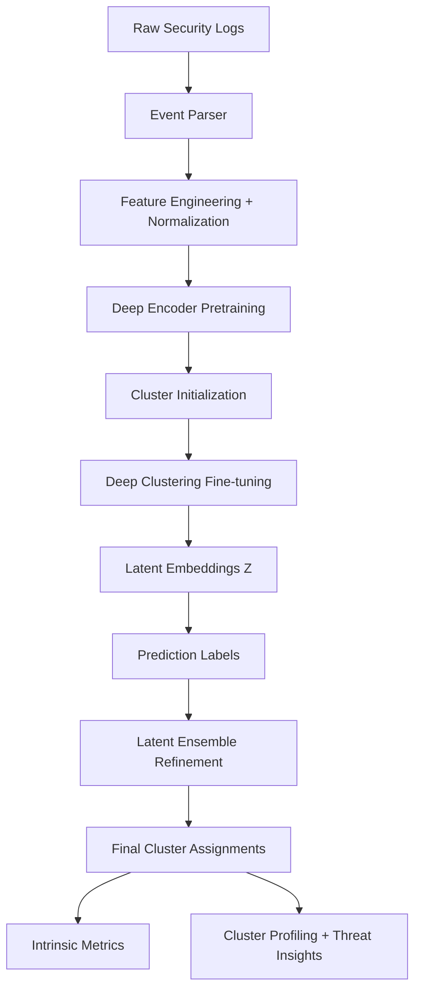
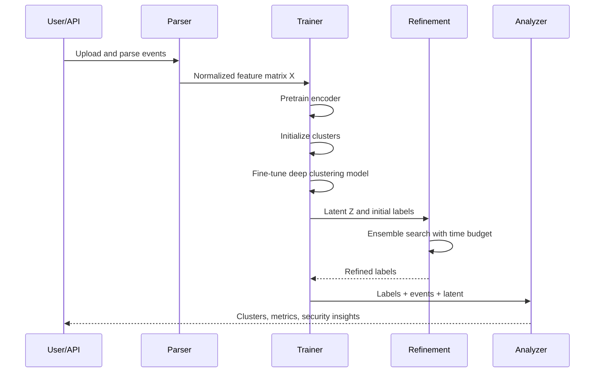

# Deep Representation Learning for Security Event Clustering

## Abstract

This document presents a research-oriented, technical description of the deep clustering system implemented in this project for large-scale security event analysis. The method combines representation learning with unsupervised partitioning of latent embeddings, followed by intrinsic quality optimization and cluster intelligence extraction. The framework supports multiple deep clustering paradigms, namely Deep Embedded Clustering (DEC), Improved DEC (IDEC), Variational Deep Embedding (VaDE), and contrastive deep clustering. A post-training latent refinement stage performs ensemble clustering search under computational constraints to improve intrinsic structure quality.

---

## 1. Problem Statement

Let a corpus of parsed security events be represented as:

```math
\mathcal{D} = \{x_i\}_{i=1}^{N}, \quad x_i \in \mathbb{R}^{d}
```


where each $x_i$ is a normalized feature vector extracted from raw logs (timestamps, network fields, subsystem, action, severity, content-derived indicators, etc.).

The objective is to learn:

1. A latent mapping $f_\theta: \mathbb{R}^{d} \rightarrow \mathbb{R}^{m}$, $m \ll d$, and  
2. A cluster assignment function $g$ that partitions latent points:

```math
z_i = f_\theta(x_i), \quad y_i = g(z_i), \quad y_i \in \{1,\dots,K\}
```

such that intra-cluster compactness is maximized and inter-cluster separation is maximized.

---

## 2. End-to-End System Architecture



---

## 3. Data Representation and Preprocessing

For each feature dimension $j$, standardization is applied:

```math
\tilde{x}_{ij} = \frac{x_{ij} - \mu_j}{\sigma_j + \epsilon}
```

where $\mu_j$ and $\sigma_j$ are empirical mean and standard deviation over the training set, and $\epsilon$ is a small constant for numerical stability.

---

## 4. Model Families

### 4.1 Deep Embedded Clustering (DEC)

DEC learns cluster-oriented latent representations by minimizing KL divergence between a soft assignment $Q$ and a sharpened target distribution $P$.

Student-t soft assignment:

```math
q_{ij} = \frac{\left(1 + \frac{\|z_i-\mu_j\|^2}{\alpha}\right)^{-\frac{\alpha+1}{2}}}
{\sum_{j'}\left(1 + \frac{\|z_i-\mu_{j'}\|^2}{\alpha}\right)^{-\frac{\alpha+1}{2}}}
```

Target distribution:

```math
p_{ij} = \frac{q_{ij}^2 / f_j}{\sum_{j'} q_{ij'}^2 / f_{j'}}, \quad f_j = \sum_i q_{ij}
```

Loss:

```math
\mathcal{L}_{DEC} = \mathrm{KL}(P\|Q) = \sum_i \sum_j p_{ij}\log\frac{p_{ij}}{q_{ij}}
```

### 4.2 Improved DEC (IDEC)

IDEC augments DEC with reconstruction preservation:

```math
\mathcal{L}_{IDEC} = \mathcal{L}_{DEC} + \gamma \cdot \mathcal{L}_{rec}
```

```math
\mathcal{L}_{rec} = \frac{1}{N}\sum_{i=1}^{N}\|x_i-\hat{x}_i\|_2^2
```

where $\gamma$ controls the reconstruction regularization strength.

### 4.3 Variational Deep Embedding (VaDE)

VaDE combines VAE inference with Gaussian mixture priors in latent space:

```math
p(z) = \sum_{k=1}^{K}\pi_k \mathcal{N}(z\mid \mu_k, \Sigma_k)
```

The training objective maximizes ELBO:

```math
\mathcal{L}_{VaDE} = \mathbb{E}_{q(z,c|x)}[\log p(x,z,c)-\log q(z,c|x)]
```

which can be interpreted as reconstruction fidelity plus regularized latent mixture alignment.

### 4.4 Contrastive Deep Clustering

Two stochastic views $x_i^{(1)}, x_i^{(2)}$ are produced by feature dropout. Encoder outputs are aligned using contrastive learning and consistency regularization.

For similarity $s(u,v)$ and temperature $\tau$, InfoNCE-style term:

```math
\mathcal{L}_{con} = -\sum_i \log
\frac{\exp(s(h_i^{(1)},h_i^{(2)})/\tau)}
{\sum_{k}\exp(s(h_i^{(1)},h_k^{(2)})/\tau)}
```

Total objective:

```math
\mathcal{L}_{total} = \mathcal{L}_{con} + \lambda_{cons}\mathcal{L}_{cons} + \lambda_{ent}\mathcal{L}_{ent}
```

where $\mathcal{L}_{cons}$ enforces view-consistent assignments and $\mathcal{L}_{ent}$ avoids degenerate low-entropy collapse.

---

## 5. Training Strategy

The training pipeline has three stages:

1. **Autoencoder/representation pretraining**  
2. **Cluster center initialization** (model-specific or latent K-means/GMM initialization)  
3. **Fine-tuning with clustering objective**



---

## 6. Intrinsic Evaluation Metrics

### 6.1 Silhouette Score

```math
s(i)=\frac{b(i)-a(i)}{\max\{a(i),b(i)\}}
```

where $a(i)$ is mean intra-cluster distance and $b(i)$ is mean nearest-cluster distance. Global score:

```math
S=\frac{1}{N}\sum_i s(i), \quad S\in[-1,1]
```

Higher is better.

### 6.2 Davies-Bouldin Index (DBI)

```math
\mathrm{DBI}=\frac{1}{K}\sum_{i=1}^{K}\max_{j\neq i}
\frac{\sigma_i+\sigma_j}{d(c_i,c_j)}
```

where $\sigma_i$ is average within-cluster scatter and $d(c_i,c_j)$ is centroid distance. Lower is better.

### 6.3 Calinski-Harabasz Score (CH)

```math
\mathrm{CH}=
\frac{\mathrm{Tr}(B_K)/(K-1)}
{\mathrm{Tr}(W_K)/(N-K)}
```

where $B_K$ is between-cluster dispersion and $W_K$ is within-cluster dispersion. Higher is better.

---

## 7. Post-Fine-Tuning Latent Ensemble Refinement

After deep model inference, labels are refined by searching over:

- Multiple clustering algorithms (K-means, GMM, Agglomerative),
- Multiple candidate cluster counts $K$,
- Multiple latent projections (original normalized latent + PCA variants),
- Validity constraints on minimal cluster size.

Best partition selection:

```math
y^*=\arg\max_{y \in \mathcal{C}} \ \mathrm{Silhouette}(Z, y)
```

with acceptance criterion:

```math
\Delta S = S(y^*) - S(y_0) \ge \delta
```

where $y_0$ is model-predicted labels and $\delta$ is a minimum gain threshold.

### Computational Guardrails

To prevent runtime stalls, refinement is bounded by:

- Maximum search time budget $T_{max}$,
- Bounded $K$-range,
- Controlled restart counts.

This provides a practical quality-latency tradeoff in production.

---

## 8. Complexity Considerations

Let $N$ be samples, $m$ latent dimension, $K$ clusters.

- **Encoder inference**: $O(N \cdot \text{NN-forward-cost})$
- **K-means trial**: approximately $O(NKmI)$ for $I$ iterations
- **Agglomerative**: can be super-linear in $N$, typically expensive
- **GMM (EM)**: approximately $O(NKmI)$, with covariance overhead

Total refinement complexity scales with:

```math
O\left(\sum_{\text{alg}\in\mathcal{A}} |\mathcal{K}| \cdot |\mathcal{R}_{alg}| \cdot \text{cost}_{alg}\right)
```

and is explicitly curtailed by the time budget.

---

## 9. Security Analytics Layer

Beyond clustering, the framework produces:

- Cluster-level threat profiles,
- Actionable indicators (source IPs, destination ports, threat indicators),
- Severity and risk stratification,
- Recommended response actions.

This bridges unsupervised representation learning with SOC-oriented operational intelligence.

---

## 10. Experimental Protocol (Recommended)

For reproducible evaluation:

1. Fix random seeds for model and clustering components.
2. Evaluate each configuration over multiple runs.
3. Report mean and standard deviation of Silhouette, DBI, CH.
4. Sweep:
   - latent dimension $m$,
   - requested clusters $K$,
   - model family (DEC/IDEC/VaDE/contrastive),
   - training epochs and regularization.
5. Add ablation:
   - with/without refinement,
   - with/without PCA projection search,
   - fixed-$K$ vs adaptive-$K$ search.

---

## 11. Practical Notes on Silhouette Targets

A Silhouette target such as $0.4+$ can be realistic for some datasets but not all. For heterogeneous security telemetry:

- overlaps between normal and suspicious behavior,
- class imbalance,
- weakly informative fields,
- mixed temporal regimes

can constrain separability in Euclidean latent spaces. Therefore, improvements should be interpreted jointly across $S$, DBI, CH, and downstream analyst utility.

---

## 12. Conclusion

This clustering system implements a modern deep unsupervised workflow for security event understanding, combining:

- deep representation learning,
- iterative cluster-aware optimization,
- intrinsic metric-driven refinement,
- and threat-centric cluster interpretation.

The resulting architecture supports both scientific evaluation and operational deployment, while preserving practical constraints through bounded post-processing.

