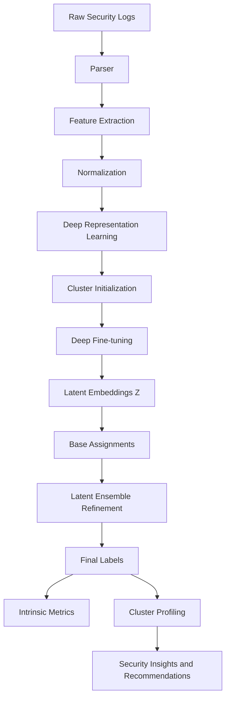
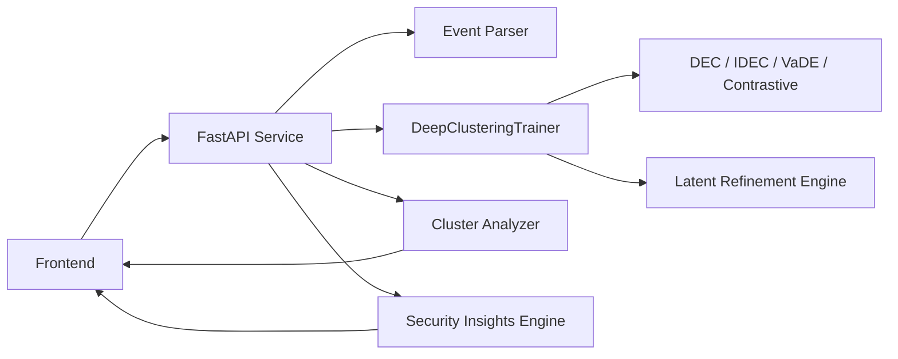
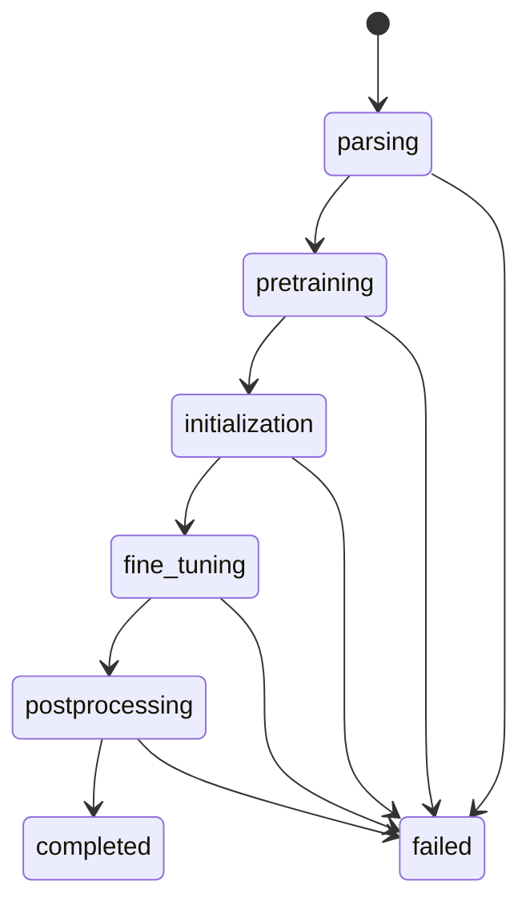
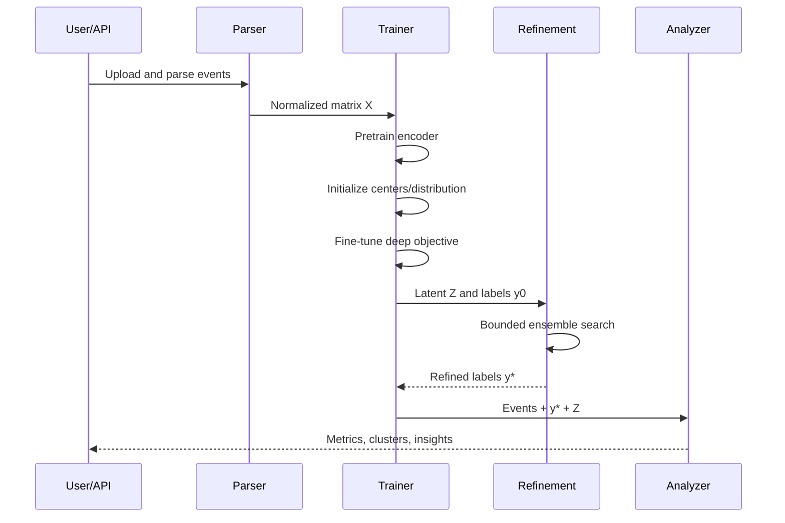
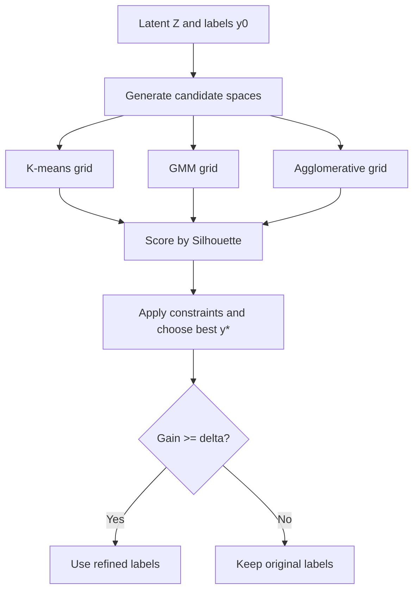

# Deep Representation Learning for Security Event Clustering

## Abstract

This document provides a research-grade technical specification for the deep clustering stack implemented in this project. The system addresses unsupervised organization of high-volume security telemetry by coupling (1) learned latent representations, (2) cluster-aware optimization objectives, and (3) post-hoc intrinsic quality maximization under runtime constraints. Supported model families include Deep Embedded Clustering (DEC), Improved DEC (IDEC), Variational Deep Embedding (VaDE), and contrastive deep clustering. The production pipeline extends classical deep clustering with an explicit latent ensemble refinement stage that performs algorithm and cluster-count search to improve partition quality, while preserving operational latency.

---

## 1. Introduction and Motivation

Modern security operations centers ingest heterogeneous, weakly labeled, and often noisy event streams from firewalls, IDS/IPS, WAF, endpoint telemetry, and authentication systems. Manual triage over millions of events is intractable. Traditional shallow clustering (single K-means over handcrafted vectors) frequently underperforms because:

- event semantics are nonlinear and sparse,
- useful dimensions are entangled with nuisance variance,
- cluster geometry is non-spherical and scale-dependent,
- useful operational clusters may not align with fixed Euclidean assumptions.

Deep clustering addresses these issues by learning latent structures jointly with clustering objectives. However, deep models can still converge to suboptimal partitions due to initialization and local minima. Therefore, this system uses a two-layer strategy:

1. learn robust latent embeddings through deep objectives, and
2. optimize assignments in latent space using intrinsic metric-driven search.

### 1.1 Related Works

Research on unsupervised security analytics spans three major lines: classical clustering, deep clustering, and domain-specific security log mining.

#### Classical Clustering and Representation Limits

Earlier operational pipelines frequently rely on K-means, hierarchical clustering, DBSCAN, or Gaussian mixtures over hand-engineered event vectors. These approaches are computationally attractive and interpretable, but they assume geometry that may not hold for mixed security telemetry:

- K-means favors spherical, equal-variance clusters under Euclidean distance.
- GMM can model softer boundaries but may still be sensitive to feature scaling and initialization.
- Hierarchical methods capture nested structure but can become expensive at scale.
- Density-based methods handle arbitrary shapes but often struggle with variable density and high-dimensional sparse features.

In SOC data, where event semantics are heterogeneous and sparse, feature engineering quality strongly determines outcome quality, creating a ceiling for shallow clustering performance.

#### Deep Clustering Literature

Deep clustering emerged to jointly learn representation and partition structure. A common paradigm is:

1. train an autoencoder (or representation backbone),
2. initialize clusters in latent space,
3. optimize a clustering-aligned objective.

Representative families include:

- **DEC-style methods**: use KL-based target distribution refinement to sharpen assignments.
- **IDEC-style methods**: preserve reconstruction during clustering updates to reduce latent drift.
- **VaDE-style methods**: combine latent generative modeling with mixture priors for probabilistic assignments.
- **Contrastive/self-supervised clustering**: enforce invariance across augmentations and improve robustness under noisy inputs.

The major lesson from these works is that representation quality and assignment quality must be optimized together, but no single objective is universally dominant across datasets.

#### Security Event Clustering and Threat Intelligence

Security-focused studies often cluster alerts/logs for:

- alert reduction and deduplication,
- campaign discovery,
- anomaly triage,
- IOC grouping and correlation analysis.

Many practical systems still use static features with shallow clustering, then apply rule-based enrichment. This can help operationally but may fail when novel attack patterns alter feature distributions. More recent works suggest combining latent learning with post-clustering semantics extraction (e.g., subsystem/action trends, source-target behavior, severity context), which aligns with SOC analyst workflows.

#### Positioning of This Work

Relative to prior lines, this implementation combines:

- deep latent learning (multiple model families),
- intrinsic metric-aware selection and monitoring,
- bounded ensemble refinement after fine-tuning,
- direct integration with security insight generation.

In other words, it bridges research-grade clustering quality optimization with production-grade API and analyst-facing outputs.

---

## 2. Problem Statement

Let the parsed event dataset be:

```math
\mathcal{D} = \{x_i\}_{i=1}^{N}, \quad x_i \in \mathbb{R}^{d}
```

where each $x_i$ is a normalized feature vector derived from raw log fields.

The goal is to estimate:

1. a parametric encoder $f_\theta: \mathbb{R}^{d} \rightarrow \mathbb{R}^{m}$, with $m \ll d$,
2. cluster assignments $y_i \in \{1,\dots,K\}$, where $K$ may be fixed or searched.

```math
z_i = f_\theta(x_i), \quad y_i = g(z_i)
```

Given no reliable labels for most production streams, optimization is unsupervised and quality is assessed through intrinsic criteria (Silhouette, DBI, CH), cluster stability, and downstream security utility.

### 2.1 Why This Problem Must Be Researched in Security

In enterprise and cloud security operations, analysts face an asymmetry problem: telemetry volume grows faster than human triage capacity. Attackers exploit this asymmetry through high-noise tactics (alert flooding, low-and-slow behavior, distributed probing), making manual pattern discovery both expensive and error-prone.

This creates a strong research need for unsupervised clustering that can:

- group semantically related events without labeled attack truth,
- reveal campaign-like behavior spanning multiple tools/subsystems,
- prioritize analyst attention toward high-risk patterns,
- reduce cognitive load and mean-time-to-understand (MTTU).

Unlike many generic clustering tasks, security clustering has mission-critical consequences. Poor grouping can hide attack progression, while useful grouping can compress thousands of low-level logs into actionable incident hypotheses.

### 2.2 Security-Specific Challenges

The security domain imposes constraints that make this problem nontrivial:

- **Label sparsity**: reliable ground truth is limited, delayed, or incomplete.
- **Non-stationarity**: attacker behavior and defensive controls evolve over time.
- **Heterogeneous telemetry**: logs from different products have different schemas and semantics.
- **Extreme imbalance**: truly malicious events are often rare relative to benign background traffic.
- **Adversarial pressure**: attackers deliberately generate evasive and noisy patterns.

Therefore, clustering must be robust not only statistically, but operationally, under drift and ambiguity.

### 2.3 Why the Target Objective Matters

The research objective is not merely to optimize an abstract metric; it is to improve security outcomes. Achieving compact, well-separated latent clusters supports:

- **Early threat discovery**: suspicious micro-patterns become visible before rule signatures exist.
- **Attack-chain visibility**: related events can be linked across time and subsystems.
- **Triage acceleration**: analysts investigate a smaller set of cluster-level entities instead of raw event streams.
- **Prioritization quality**: critical/high-risk clusters are easier to isolate and escalate.
- **Knowledge transfer**: cluster profiles can be reused for threat hunting and detection engineering.

In practical SOC terms, this maps to faster detection-to-response loops and lower risk of missed incidents.

### 2.4 Formal Security Utility Perspective

Let $\mathcal{I}(y)$ denote incident utility of assignments $y$, reflecting analyst-facing value (prioritization accuracy, cluster interpretability, threat enrichment quality). The system seeks high intrinsic structure while preserving operational utility:

```math
\max_{f_\theta,\,g} \ \mathcal{Q}_{intrinsic}(y, Z) + \lambda \,\mathcal{I}(y)
```

where $\mathcal{Q}_{intrinsic}$ aggregates intrinsic quality signals (e.g., Silhouette, DBI, CH) and $\lambda$ controls emphasis on SOC utility. This framing clarifies why research should jointly optimize geometric quality and security relevance.

### 2.5 Success Criteria Under Security Constraints

A meaningful solution in this domain should satisfy:

1. intrinsic quality improvement over shallow baselines,
2. stable clusters under moderate data perturbations,
3. actionable semantic profiles for analyst workflows,
4. bounded runtime compatible with production response windows.

Hence, this problem is worth pursuing because it addresses both scientific challenges (unsupervised representation and partitioning under drift/noise) and operational security needs (faster, more reliable incident understanding).

---

## 3. Research Contributions of This System

This implementation contributes the following engineering-research elements:

- Multi-family deep clustering support in one pipeline (DEC/IDEC/VaDE/contrastive).
- Stage-aware training orchestration and real-time progress reporting.
- Intrinsic metric computation integrated into both training and result APIs.
- Post-fine-tuning latent ensemble refinement:
  - multi-algorithm search (K-means, GMM, agglomerative),
  - multi-$K$ search over bounded ranges,
  - multi-projection search (latent + PCA variants),
  - minimum cluster-size constraints,
  - hard wall-clock budget to avoid operational stalls.
- Security analytics integration from cluster outputs to threat-centric summaries.

---

## 4. End-to-End System Architecture

### 4.1 High-Level Data Flow



This data-flow figure describes how raw security telemetry is transformed into analyst-ready cluster intelligence. Each labeled block corresponds to a distinct transformation step:

- **`A: Raw Security Logs`**: source event strings collected from security tooling (firewalls, IDS/IPS, WAF, authentication, etc.).
- **`B: Parser`**: parses raw strings into structured event fields (timestamp, src/dst, subsystem, action, severity, and content-derived signals when available).
- **`C: Feature Extraction`**: converts parsed event fields into a fixed-length numeric vector per event, capturing semantics relevant to clustering.
- **`D: Normalization`**: standardizes each feature dimension using dataset mean and variance so that distance computations in later steps are stable and comparable.
- **`E: Deep Representation Learning`**: the encoder part of the selected deep clustering model maps normalized features into a latent embedding space where cluster geometry is more separable.
- **`F: Cluster Initialization`**: produces initial cluster seeds/assignments (e.g., via GMM/K-means in latent space or model-specific initialization) to prevent degenerate clustering updates.
- **`G: Deep Fine-tuning`**: optimizes the clustering-aware objective (DEC/IDEC/VaDE/contrastive) to refine both latent geometry and soft assignment structure.
- **`H: Latent Embeddings Z`**: stores the learned embedding vectors $z_i=f_\theta(x_i)$ for all events, which are the basis for final clustering and metrics.
- **`I: Base Assignments`**: converts model outputs into discrete cluster labels (typically by taking argmax over soft assignment probabilities).
- **`J: Latent Ensemble Refinement`**: performs a bounded search over alternative latent partitions (algorithm choice, cluster-count candidates, and projection variants) to improve intrinsic quality.
- **`K: Final Labels`**: selects the refined labels and treats them as the canonical clustering result for downstream profiling.
- **`L: Intrinsic Metrics`**: computes Silhouette, Davies–Bouldin, and Calinski–Harabasz from the same latent representation used for clustering, enabling consistent quality reporting.
- **`M: Cluster Profiling`**: aggregates per-event information under each label to produce cluster summaries such as dominant subsystems/actions and representative events.
- **`N: Security Insights and Recommendations`**: converts cluster profiles into analyst-facing intelligence (threat indicators, priority/risk assessment, and recommended actions).

### 4.2 Runtime Component View



This runtime component view explains where each transformation is executed and how data moves between runtime services:

- **`U: Frontend`**: controls the user workflow (start training, poll progress, fetch results) and renders cluster metrics and insights.
- **`API: FastAPI Service`**: exposes HTTP endpoints (train, status, results, cluster events, insights) and coordinates background training so the UI thread stays responsive.
- **`PARSER: Event Parser`**: reused by the API to parse raw strings into structured events and then to produce normalized feature matrices for training.
- **`TRAINER: DeepClusteringTrainer`**: encapsulates model training logic, including pretraining, initialization, fine-tuning, and inference of latent embeddings and soft assignments.
- **`MODELS: DEC / IDEC / VaDE / Contrastive`**: selects the deep clustering objective family; it defines how embeddings are shaped and how assignments are represented.
- **`REFINE: Latent Refinement Engine`**: post-processes model output using intrinsic metrics by exploring candidate partitions under time and validity constraints.
- **`ANALYZER: Cluster Analyzer`**: consumes refined labels and events to compute cluster-level profiles (representative events, top entities, severity distributions, etc.).
- **`INSIGHTS: Security Insights Engine`**: maps cluster profiles into higher-level intelligence (risk assessment, attack pattern hints, and correlations).

### 4.3 Stage Transitions



Stage transitions make the end-to-end compute schedule explicit. This is especially important for security analytics UX, because the UI needs to distinguish model convergence from expensive bounded post-processing. Each stage corresponds to a specific technical operation:

- **`parsing`**: converts raw event strings into structured events and a normalized feature matrix; errors here typically reflect schema problems or unsupported input formats.
- **`pretraining`**: learns an embedding manifold that supports clustering by reconstruction (DEC/IDEC/VaDE) or contrastive invariance (contrastive).
- **`initialization`**: establishes initial cluster assignments/seeds in latent space; deep clustering objectives are sensitive to this step, and poor seeds can lead to collapse-like solutions.
- **`fine_tuning`**: optimizes the selected deep clustering objective while periodically updating assignments/targets and monitoring intrinsic metrics and assignment drift.
- **`postprocessing`**: refines the final discrete partition via latent ensemble search (varying algorithm type, candidate cluster counts, and latent projections) under a strict runtime budget and validity constraints (e.g., minimum cluster size).
- **`completed`**: the API can safely return final results (labels, intrinsic metrics, latent visualization, and cluster profiles).
- **`failed`**: any unrecoverable error in the corresponding stage triggers this terminal state, allowing the UI to surface a diagnostic message rather than waiting indefinitely.

If you observe logs such as `Fine-tuning complete!` without a rapid `completed`, it typically indicates the system is still in `postprocessing` (bounded refinement), not that training is stuck.

---

## 5. Data Representation and Preprocessing

### 5.1 Structured Event Vectorization

Raw events are parsed into typed fields (network tuple, subsystem/action semantics, severity, content tokens, etc.) and converted into fixed-dimensional vectors.

### 5.2 Normalization

Per-feature standardization:

```math
\tilde{x}_{ij} = \frac{x_{ij} - \mu_j}{\sigma_j + \epsilon}
```

where $\mu_j$ and $\sigma_j$ are dataset statistics and $\epsilon$ prevents divide-by-zero.

### 5.3 Why Normalization Matters

- stabilizes gradient scales during autoencoder pretraining,
- reduces dominance of high-magnitude numeric fields,
- improves distance comparability in latent-space clustering.

### 5.4 Noise and Sparsity Considerations

Security logs often include:

- missing fields,
- repeated boilerplate,
- bursty anomalies,
- mixed periodic and attack-driven behavior.

Latent learning mitigates these effects by compressing correlated structure and suppressing irrelevant variance.

---

## 6. Model Families

## 6.1 Deep Embedded Clustering (DEC)

DEC refines latent space by minimizing divergence between soft assignments and sharpened targets.

Soft assignment:

```math
q_{ij} = \frac{\left(1 + \frac{\lVert z_i-\mu_j \rVert^2}{\alpha}\right)^{-\frac{\alpha+1}{2}}}
{\sum_{j'}\left(1 + \frac{\lVert z_i-\mu_{j'} \rVert^2}{\alpha}\right)^{-\frac{\alpha+1}{2}}}
```

Target distribution:

```math
p_{ij} = \frac{q_{ij}^2 / f_j}{\sum_{j'} q_{ij'}^2 / f_{j'}}, \quad f_j=\sum_i q_{ij}
```

Loss:

```math
\mathcal{L}_{DEC} = \mathrm{KL}(P\|Q)=\sum_i\sum_j p_{ij}\log\frac{p_{ij}}{q_{ij}}
```

**Advantages**: directly cluster-focused objective.  
**Limitations**: risk of representation drift if reconstruction signal is absent.

## 6.2 Improved DEC (IDEC)

IDEC adds reconstruction regularization:

```math
\mathcal{L}_{IDEC}=\mathcal{L}_{DEC}+\gamma\mathcal{L}_{rec}
```

```math
\mathcal{L}_{rec}=\frac{1}{N}\sum_{i=1}^N \lVert x_i-\hat{x}_i \rVert_2^2
```

This balances cluster compactness and information preservation. In operational telemetry, IDEC often yields more stable, interpretable partitions.

## 6.3 Variational Deep Embedding (VaDE)

VaDE places a Gaussian mixture prior on latent codes:

```math
p(z)=\sum_{k=1}^K \pi_k\mathcal{N}(z\mid\mu_k,\Sigma_k)
```

Optimizes ELBO-style objective:

```math
\mathcal{L}_{VaDE}=\mathbb{E}_{q(z,c\mid x)}[\log p(x,z,c)-\log q(z,c\mid x)]
```

**Advantages**: probabilistic assignments, uncertainty-friendly latent geometry.  
**Limitations**: higher optimization complexity; sensitive to initialization.

## 6.4 Contrastive Deep Clustering

Two augmented views of each sample are encoded, and representation consistency is enforced.

Contrastive term (InfoNCE style):

```math
\mathcal{L}_{con}
=-\sum_i \log
\frac{\exp(s(h_i^{(1)},h_i^{(2)})/\tau)}
{\sum_k\exp(s(h_i^{(1)},h_k^{(2)})/\tau)}
```

Total training objective:

```math
\mathcal{L}_{total}
=\mathcal{L}_{con}
+\lambda_{cons}\mathcal{L}_{cons}
+\lambda_{ent}\mathcal{L}_{ent}
```

**Advantages**: robust under heavy noise/augmentation.  
**Limitations**: compute-heavy; requires careful augmentation design.

## 6.5 Model Selection Guidance

- **IDEC**: default for balanced quality + stability.
- **DEC**: simpler/faster when reconstruction fidelity is less critical.
- **VaDE**: when probabilistic interpretation is required.
- **Contrastive**: when invariance to perturbation/noise is a priority.

---

## 7. Training Strategy

### 7.1 Stage-Wise Optimization

1. **Pretraining**: learn stable embedding manifold.
2. **Initialization**: estimate cluster seeds in latent space.
3. **Fine-tuning**: optimize clustering-aware objective.
4. **Postprocessing**: latent ensemble refinement with constraints.

### 7.2 Sequence-Level Workflow



### 7.3 Convergence and Monitoring

The trainer monitors periodic intrinsic metrics and assignment drift:

```math
\Delta_t=\frac{1}{N}\sum_i \mathbf{1}[y_i^{(t)} \ne y_i^{(t-1)}]
```

If $\Delta_t$ is below tolerance, fine-tuning can terminate early.

### 7.4 Operational Progress Semantics

The API reports stages including `pretraining`, `initialization`, `fine-tuning`, and `postprocessing`, avoiding false perception of hangs during expensive refinement.

---

## 8. Intrinsic Evaluation Metrics

## 8.1 Silhouette Score

Per-sample score:

```math
s(i)=\frac{b(i)-a(i)}{\max\{a(i),b(i)\}}
```

Dataset score:

```math
S=\frac{1}{N}\sum_i s(i), \quad S\in[-1,1]
```

Interpretation:

- near 1: compact and well-separated,
- near 0: overlapping boundaries,
- negative: likely misassignment.

## 8.2 Davies-Bouldin Index

```math
\mathrm{DBI}=\frac{1}{K}\sum_{i=1}^{K}\max_{j\neq i}\frac{\sigma_i+\sigma_j}{d(c_i,c_j)}
```

Lower is better; high values indicate high within-cluster scatter and weak inter-centroid separation.

## 8.3 Calinski-Harabasz Score

```math
\mathrm{CH}
=\frac{\mathrm{Tr}(B_K)/(K-1)}{\mathrm{Tr}(W_K)/(N-K)}
```

Higher is better; ratio of between-cluster dispersion to within-cluster dispersion.

## 8.4 Joint Interpretation

No single metric is sufficient. A practical acceptance region often requires:

- high or improved Silhouette,
- low or decreasing DBI,
- high or increasing CH,
- plus cluster-size sanity and analyst relevance.

---

## 9. Post-Fine-Tuning Latent Ensemble Refinement

### 9.1 Motivation

Fine-tuned model labels may be locally optimal but not globally best under intrinsic criteria. Refinement performs bounded search in latent space to recover better partitions.

### 9.2 Search Space

- Algorithms: K-means, Gaussian Mixture, Agglomerative.
- Cluster counts: bounded candidate set $\mathcal{K}$.
- Feature spaces: normalized latent and PCA projections.
- Constraints: minimum cluster size threshold.

Selection objective:

```math
y^*=\arg\max_{y\in\mathcal{C}} \mathrm{Silhouette}(Z,y)
```

Adoption criterion:

```math
\Delta S=S(y^*)-S(y_0)\ge\delta
```

where $y_0$ is original model prediction and $\delta$ is a minimum gain threshold.

### 9.3 Runtime Guardrails

- search-time cap $T_{max}$,
- reduced restart counts,
- bounded $K$-range,
- immediate return with best-so-far solution when time budget is hit.

These guardrails keep quality improvements practical for production API latency.

### 9.4 Conceptual Figure



---

## 10. Complexity Considerations

Let $N$ be number of points, $m$ latent dimension, $K$ clusters, and $I$ iterative solver steps.

### 10.1 Stage-wise Complexity

- Encoder forward extraction: $O(N \cdot C_f)$ where $C_f$ is network forward cost.
- K-means candidate: approximately $O(NKmI)$.
- GMM candidate (EM): approximately $O(NKmI)$ with covariance overhead.
- Agglomerative candidate: super-linear, often dominant for large $N$.

### 10.2 Ensemble Search Complexity

```math
O\left(\sum_{a\in\mathcal{A}} |\mathcal{K}| \cdot |\mathcal{R}_a| \cdot \mathrm{cost}(a)\right)
```

where $\mathcal{A}$ is algorithm set and $\mathcal{R}_a$ are restarts for algorithm $a$.

### 10.3 Practical Cost Control

Through explicit time budgets and bounded candidate sets, effective runtime becomes:

```math
\min\left(\text{full search cost},\ T_{max}\right)
```

---

## 11. Security Analytics Layer

Cluster outputs are mapped to analyst-facing intelligence:

- threat-level estimation per cluster,
- dominant subsystems/actions,
- representative events,
- top source IPs and destination ports,
- recommended mitigation actions,
- IOC and correlation extraction.

This conversion from unsupervised clusters to actionable security semantics is central for SOC integration.

---

## 12. Experimental Design and Evaluation Protocol

### 12.1 Reproducibility

- fix random seeds across PyTorch and clustering backends,
- record model hyperparameters and selected refinement outputs,
- run each configuration multiple times.

### 12.2 Core Experiments

1. **Model family comparison**: DEC vs IDEC vs VaDE vs contrastive.
2. **Latent dimension sweep**: impact of $m$ on separability.
3. **Cluster count sensitivity**: fixed $K$ vs adaptive search.
4. **Refinement ablation**:
   - no refinement,
   - fixed-$K$ refinement,
   - adaptive-$K$ ensemble refinement.
5. **Runtime-quality Pareto**: metric gains vs postprocessing time budget.

### 12.3 Reporting

Report mean and standard deviation for:

- Silhouette,
- DBI,
- CH,
- cluster-size dispersion,
- runtime breakdown per stage.

---

## 13. Threats to Validity

- **Data validity**: synthetic or narrow-domain logs may inflate metrics.
- **Metric validity**: intrinsic metrics do not fully capture operational relevance.
- **Model validity**: hyperparameter sensitivity may bias conclusions.
- **Deployment validity**: concept drift and seasonality can degrade quality over time.

Recommended mitigation includes periodic retraining, drift monitoring, and analyst-in-the-loop validation.

---

## 14. Practical Notes on Silhouette Targets

A target such as $0.4+$ may be achievable for some datasets but is not universally guaranteed for real-world mixed security telemetry. Constraining factors include:

- overlap between benign and malicious behaviors,
- severe class imbalance,
- weak feature observability,
- mixed temporal regimes and policy shifts.

Therefore, optimization should use multi-metric and operational criteria, not a single scalar target.

---

## 15. Future Directions

Potential research and engineering extensions:

- self-supervised pretraining with richer augmentations,
- graph-based event correlation embeddings,
- temporal deep clustering with sequence encoders,
- online/incremental clustering for streaming SOC workflows,
- stability-based automatic $K$ selection,
- analyst feedback loops for weak supervision.

---

## 16. Conclusion

This system implements a production-aware deep clustering framework for security event intelligence, integrating:

- representation learning,
- cluster-aware optimization,
- intrinsic metric evaluation,
- bounded latent ensemble refinement,
- and threat-centric interpretation.

The resulting design is both scientifically grounded and operationally actionable, with explicit mechanisms to balance quality and runtime in real deployments.

